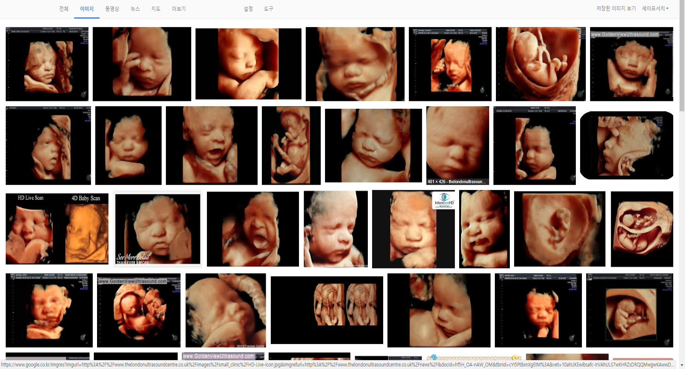
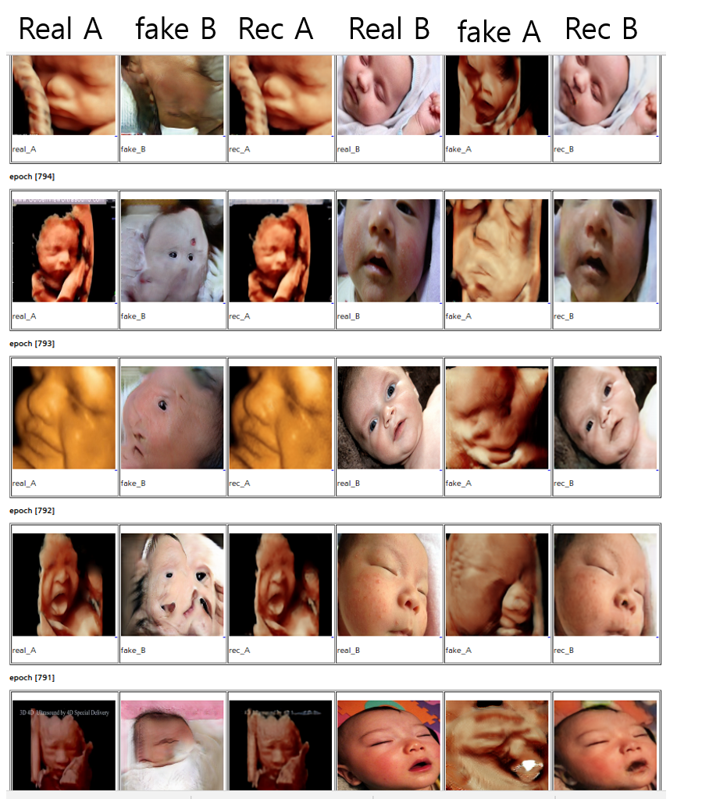
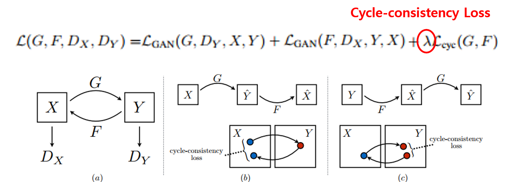
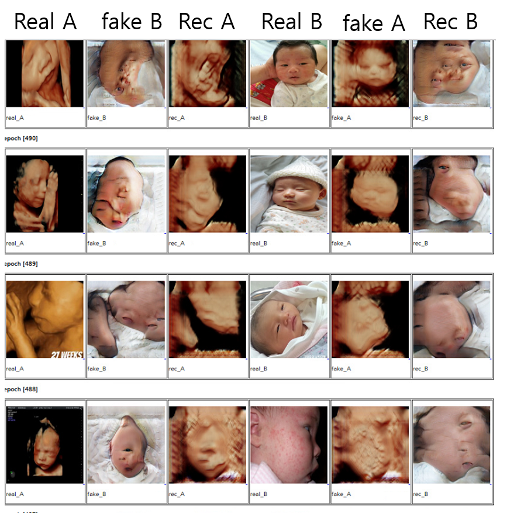

[그림 1.] 본 프로젝트의 목표

## 목표
태아의 볼륨렌더링 영상을 태어난 후의 실제 사진처럼 변환하고자 한다.
※ 다소 충격적인 비주얼이 포함되어 있으니 심장이 약하거나 임산부, 노약자는 보지 않으시길 권장합니다.
  
## 배경
산부인과에서는 태아가  37주 경에 산모에게 태아의 3D 혹은 4D 볼륨렌더링 이미지를 촬영(실제 제공되는 사진은 2D 이다)하는 항목이 있다. 진단을 위한 항목이라기 보다는 태아의 실제 얼굴이 궁금한 산모에게 태아의 얼굴을 그럴듯 하게 렌더링 해서 보여주는 이벤트에 가깝다. 일반적으로 초음파 3D 볼륨데이터에 
볼륨렌더링을 적용하여 보여주는데, 최근에 와서는 실제 피부의 반투명한 느낌까지도 반영하여 그럴듯 한 결과를 제공하고 있다. 
매우 그럴듯한 결과를 제공함에도 불구하고, 실제 태어났을때의 사진같은 느낌 보다는 여전히 인위적으로 만든 듯한 느낌을 주기 때문에 최근
각광받는 Generative Adversarial Networks를 활용하여 아기가 태어났을때의 모습을 예측하여 생성결과를 보여주면 어떨까라는 생각에서 이 프로젝트를 시작했다.

[그림 2.] 다양한 태아의 볼륨렌더링 영상 검색 결과들

## 방법
초음파 렌더링 영상과 실제 사진의 pair가 있다면 Pix2Pix와 같은 conditional GAN을 활용하면 된다. 하지만, 이 문제는 이전에 진행한 수묵화 프로젝트와 마찬가지로 unpaired data간의 변환을 찾아야 하는 문제이다.
일단 unpaired data간의 변환하면 생각나는 것은 CycleGAN과 DISCOGAN일 것이다. 데이터는 구글검색을 통해 많진 않지만 200케이스 정도는 쉽게 수집 가능하다. 또한, http://3dand4d.com/ 에서는 초음파 렌더링 이미지와 대응하는 
실제 태어난 이후의 이미지를 before/after 형태로  보여주는 갤러리가 있다. 물론, 자세와 표정 손의 위치까지 비슷하게 찍었지만, 기하학적으로 정확한 pairing을 한 것은 아니다. 
1차적으로 구글에서 클롤링해서 얻은 초음파 데이터셋(A)과 아기의 사진 데이터 셋(B)에 대한 CycleGAN을 무작정 돌려본 후에 발생하는 문제를 
해결해 나가고자 한다.    

## 실험결과 
최대한 빨리 결과를 확인하고 싶어서 초음파 데이터셋(67개), 아기사진(121개)를 크롤링하여 CycleGAN(https://github.com/junyanz/pytorch-CycleGAN-and-pix2pix)을 적용하였다.
총 epoch는 800번 수행하였고, 나머지 기본적인 hype parameter는 default setting을 그대로 적용하였다. 
결과는 아래와 같이 처참하다 ㅡㅡ;; 이쁘 아기 사진을 기대하였기 때에 충격이 크다. 한번에 잘 나올것으로 기대한것은 아니지만, 이렇게 무시무시한 도깨비가 나올줄은 생각도 못했다. 

[그림 3.] 학습결과 (Lamda = 10)
몇가지 문제점을 체크해보자. 

1. 데이터 셋 구성 : 아무래도 원 논문에서 실험에 사용한 데이터셋 갯수가 1000케이스 이상인 것으로 보아 상대적으로 너무 적은 데이터를 학습에 사용했다.
또한, 내 가정이긴 하지만, 데이터셋 A와 B사이에 포즈와, 스케일등의 데이터의 특성에서 차이가 큰 것도 문제가 될 것으로 보인다. 
예를 들어 극단적으로 데이터셋 A에는 태아의 옆모습(초음파)만 존재하고, 데이터셋B에는 태아의 정면만(사진)존재하면 학습이 불가능할 것이다. 
충분한 데이터를 확보하고, data의 variation에 신경을 써서 수집해 볼 생각이다. http://3dand4d.com/에 제공되는 데이터는 초음파 사진과 실제 사진의 자세를 매우 유사하게 만들었기 때문에
이것을 활용해 볼 생각이다. 

2. cyclegan의 hyperparmeter 중 cycle-consistency[그림 4.]에 lamda라는 가중치를 조절할 수 있다. 이 가중치는 GAN loss와 cycle-consistency loss사이의 중요도를 결정하는 
요소이다. default는 10이고, [그림 3.]의 결과를 보면, fake B(생성 결과)는 매우 안좋은 결과를 얻었지만, recon A (복원 결과)는 원본과 매우 유사하게 복원된 것을 볼 수있다. [그림 5.] 는 lamda를 10에서 1로 바꿔서 얻은 실험 결과이다. recon A결과가 앞선 실험(lamda = 10)에서 보다 fake B의 결과는 더 변화무쌍해지고, 상대적으로 recon A의 결과는 원본과 비교하여 
차이가 커졌다. lamda의 변화만으로는 도깨비를 아기로 바꾸기 힘들어 보인다. 

[그림 4.] CycleGAN Loss

[그림 5.] 학습결과 (Lamda = 1)

Updata 예정 ....

