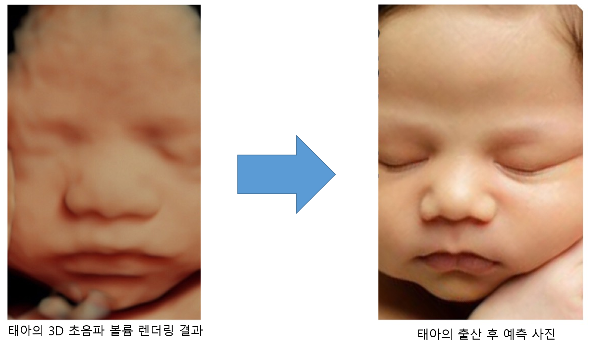

## 목표
태아의 볼륨렌더링 영상을 태어난 후의 실제 사진처럼 변환하고자 한다.

## 배경
산부인과에서는 태아가  37주 경에 산모에게 태아의 3D 혹은 4D 볼륨렌더링 이미지를 촬영(실제 제공되는 사진은 2D 이다)하는 항목이 있다. 진단을 위한 항목이라기 보다는
태아의 실제 얼굴이 궁금한 산모에게 태아의 얼굴을 그럴듯 하게 렌더링 해서 보여주는 이벤트에 가깝다. 일반적으로 초음파 3D 볼륨데이터에 
볼륨렌더링을 적용하여 보여주는데, 최근에 와서는 실제 피부의 반투명한 느낌까지도 반영하여 그럴듯 한 결과를 제공하고 있다. 
매우 그럴듯한 결과를 제공함에도 불구하고, 실제 태어났을때의 사진같은 느낌 보다는 여전히 인위적으로 만든 듯한 느낌을 주기 때문에 최근
각광받는 Generative Adversarial Networks를 활용하여 아기가 태어났을때의 모습을 예측하여 생성결과를 보여주면 어떨까라는 생각에서 이 프로젝트를 시작했다.
 
## 방법
초음파 렌더링 영상과 실제 사진의 pair가 있다면 Pix2Pix와 같은 conditional GAN을 활용하면 된다. 하지만, 이 문제는 이전에 진행한 수묵화 프로젝트와 마찬가지로 unpaired data간의 변환을 찾아야 하는 문제이다.
일단 unpaired data간의 변환하면 생각나는 것은 CycleGAN과 DISCOGAN일 것이다. 데이터는 구글검색을 통해 많진 않지만 200케이스 정도는 쉽게 수집 가능하다. 또한, http://3dand4d.com/ 에서는 초음파 렌더링 이미지와 대응하는 
실제 태어난 이후의 이미지를 before/after 형태로  보여주는 갤러리가 있다. 물론, 자세와 표정 손의 위치까지 비슷하게 찍었지만, 기하학적으로 정확한 pairing을 한 것은 아니다. 

1차적으로 구글에서 클롤링해서 얻은 초음파 데이터셋(A)과 아기의 사진 데이터 셋(B)에 대한 CycleGAN을 무작정 돌려본 후에 발생하는 문제를 
해결해 나가고자 한다.    
