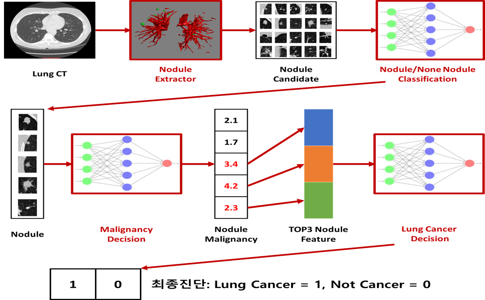

[**지능정보기술연구원(AIRI)**](http://airi.kr)은 의료분야에 진출하기 위한 일환으로 [**Kaggle Data Science Bowl 2017**](https://www.kaggle.com/c/data-science-bowl-2017)에 처음으로 참가하였고, 부족하지만 의미있는 결과를 얻게 되어 공유하고자 합니다. 

## Data Science Bowl 2017

**목표** : 1년 내 폐암 예측 모델링  
**기간** : 2017.01.12 ~ 2017.04.07    
Stage 1 : 2017.01.12 ~ 2017.03.31  
Stage 2 : 2017.04.08 ~ 2017.04.12  
**참가팀수** : 1972팀  
**학습데이터** : 1397개의 확진 1년 전 폐 CT 영상 데이터와 폐암 여부 Label  
**Validation 데이터** :  198개  
**Test 데이터** : 506개  
**외부데이터** : 외부데이터를 사용 가능하며, 사용 시 공개해야 함  

## 최종 결과
공식적으로 **1972**팀 중에 **Public Leader Board 31위(상위 1.5%)**, **Private Leader Board 243위(상위 12%)**를 기록했고, 비공식적 기록으로는 **Private Leader Board 50위권(상위 2.5%)**에 해당하는 결과를 얻었습니다.
비공식적 기록과 공식적 기록의 이러한 차이에는 저의 사소하지 않은 실수가 있었습니다.  Public Leader Board에서 submit했던 결과(test data 1%에 대한 log loss)들을 기반으로 2개의 submit을 선택하면 test data 99%에 대한 최종 결과 중 가장 좋은 결과로 Private Leader board의 순위가 결정됩니다. 대회 마감 직전에 팀원과의 의사소통에 착오가 있었고, 제가 submit을 엉뚱한 것을 하는 바람에 50위 (log loss : 0.53493)가 243위 (log loss : 0.63926)로 떨어지는 안타까운 상황이 벌어졌습니다.  결과에 아쉬움은 남지만, 짧은 기간에 많은 것을 경험했습니다. 이러한 우리의 경험이 kaggle에 도전하고자 하는 분들에게 조금이나마 도움이 되었으면 합니다.

## 팀 빌딩

2017년 1월 20일에 Competition 참가를 결정, 팀을 꾸렸습니다.  저희 팀은 두 분의 딥러닝 소프트웨어 엔지니어, 영상유도 방사선 치료를 전공하신 연구원, 강남 세브란스 병원 영상의학과 교수님 두 분, 그리고 컴퓨터 비젼과 머신러닝을 기반으로 초음파 자동 진단 시스템을 개발해 온 저를 포함한 6명으로 구성되었습니다.
아시는 분은 아시겠지만, 초음파 영상이 의료영상처리에서 가장 noisy하고 variation이 큽니다. 초음파에서의 비슷한 개발 경험이 많았기 때문에 CT에서 특히 전처리에는 자신이 있었습니다. 그러기에 저희 팀의 작전은 이랬습니다. 전처리를 남들보다 잘하고, classification은 남들만큼만 하면 승산이 있지 않을까? (사실 저만의 생각이었을지도 모르겠습니다. 저는 딥러닝을 아직까지는  완전히 신뢰하지 않았던 것 같습니다.) 

## 접근 방법

본 대회는  1년 전의 폐 영상을 보고, 1년 후의 폐암 진단 여부를 추정하는 문제를 푸는 것입니다. 먼저, 이와 관련된 기존 연구를 찾아보았습니다. 이 분야는 오래전부터 폐 CT에서 폐결절(nodule)을 추출하는 연구를 머신러닝 기반으로 해왔으나 최근에는 CNN기반으로 대체되어 오고 있었습니다. 또한 악성양성 여부를 판단하는 연구도 간혹 있었습니다.
kaggle DSB 2017에서 주어진 데이터는 폐 CT 데이터와 대응하는 암 발생 여부 label이 전부 입니다. 이들 연구에서 다행히 오픈 데이터셋인 LIDC(Lung Image Database Consortium) 이 많이 사용되어 오고 있고, 저희도 이 데이터셋을 적극 활용하기로 결정하였습니다. LIDC데이터에는 3mm~30mm에 속하는 nodule에 대한 마스크 이미지와 관련 특성 정보를 4명의 의사가 labeling한 내용을 제공합니다. 

문제는 1년 전의 폐 CT에 nodule이 아닌 다른 징후로부터 암 발생을 예측할 필요가 있을지의 여부였습니다. 이쯤되니 도메인 전문가없이 저희들끼리 고민할 문제가 아니더군요. 결국, 내부 인맥을 동원해 강남 세브란스 영상의학과 교수님들과 미팅을 하고, 임상적 판단 기준과 이 대회에 대한 의견을 들을 수 있었습니다. 또한, 서울대 영상의학과 미팅과 일산병원 건강보험관리공단 빅테이터 모임에 참석해서 전문가 분들의 의견을 들을 수 있었습니다. 공통적인 의견은 1년 전에 전혀 징후가 없다가 암이 발병하지 않을 것이니, nodule을 기반으로 악성 양성 판단하는 문제로 봐도 될 것 같다는 것이었습니다. 
이제 문제는 좀 더 명확해 졌습니다. 폐CT에서 nodule을 잘 찾아서 악성/양성 판별을 잘하면 되는 것입니다. 

## 워크플로우

대부분의 기존 관련 연구는 전처리를 통한 nodule 후보군 추출과 nodule 후보군으로부터 false positive를 줄이기 위한 nodule classification으로 구성되었기에 저희 팀도 이 방법을 택했습니다. 또한, kaggle tutorial게시판에 다양한 전처리 코드들이 제공되었기에 처음 이 분야를 시작하는 입장에서 방향을 잡는데 도움이 많이 되었습니다. 아래 그림은 전체적인 workflow를 보여줍니다.

# 1. 데이터 전처리

전처리단계에서는 최종 테스트를 위한 kaggle 데이터로 부터 nodule 후보군을 추출하기 위한 것입니다. 입력데이터는 DICOM 포맷의 폐 CT데이터 입니다. 전처리 단계에서는 DICOM 영상의 Hounsfield Unit(조직의 X선 감쇠 정도를 정량화한 단위)변환, resampling (mm per voxel을 1로 resampling 수행), 폐 영역 segmentation, nodule 후보군 추출이 수행됩니다. 
우리는 3D 영상처리 기반의 전처리와 2D U-net기반의 전처리를 각각 수행하였습니다.
영상처리 기반의 전처리 단계에서는 폐영역의 HU (-400)값을 기준으로 폐영역을 추출하고, 폐영역 내부에 상대적으로 밝은 영역(혈관 및 nodule)을 adaptive thresholding으로 추출 한 후, size test와 shape analysis를 통해 nodule 후보를 필터링했습니다.
U-net기반의 전처리를 수행할 경우 폐 segmentation은 생략하였는데, 그 이유는 영상처리 기반의 전처리에서 폐 segmentation 실패를 보완하기 위함이었습니다. 
튜토리얼에 공개된 코드들은 상당부분 문제를 해결할 수 있지만 각각의 알고리즘은 서로 다른 제약이 있었고, 몇몇 critical한 문제를 처리하지 못하는 경우 (폐 경계부분의 nodule이 제거되는 문제)가 다수 발생하여, 관련 논문 서치 및 과거의 다양한 전처리 경험을 활용하여 상당부분을 개선했습니다.  U-net기반의 전처리와 영상 처리 기반의 전처리에서 최종 결과는 큰 차이가 없음을 확인하였습니다. 

# 2. 학습데이터 처리

앞서 말씀드린 바와 같이 kaggle데이터는 nodule에 대한 label이 제공되지 않기 때문에 nodule/non-nodule classification 및 nodule의 malignancy classification은 LIDC 데이터 셋을 활용하여 학습하였습니다. nodule 학습데이터는 70x70x70의 3D 데이터로부터 아래 그림과 같이 9방향의 2D 이미지를 추출하여 9채널 데이터를 생성하였습니다 [1]. 9채널 이미지가 nodule의 특성을 잘 나타내면서도 computational cost가 3D에 비해 효율적인 장점이 있다고 판단하였습니다. 
데이터 augmentation은 flip, rotation, different margin을 적용하였고, scale은 malignancy 판단에 영향을 줄 수 있기 때문에 적용하지 않았습니다. 데이터 normalization은 [-1,1]로 처리하였습니다. 

