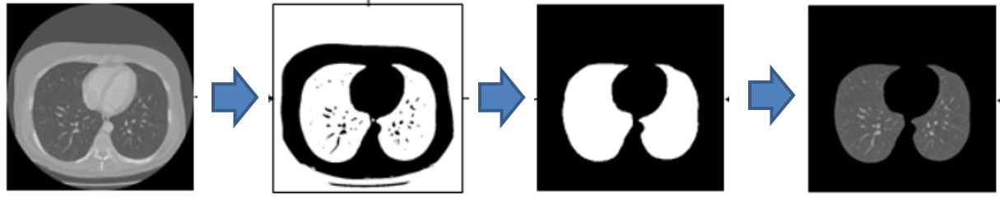
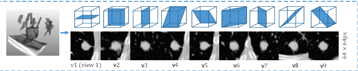
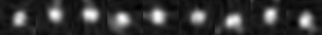
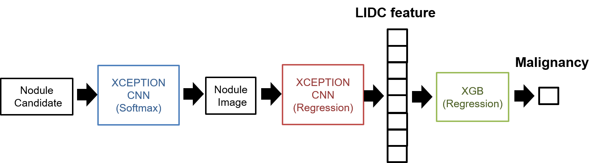

[**지능정보기술연구원(AIRI)**](http://airi.kr)은 의료분야에 진출하기 위한 일환으로 [**Kaggle Data Science Bowl 2017**](https://www.kaggle.com/c/data-science-bowl-2017)에 처음으로 참가하였고, 부족하지만 의미있는 결과를 얻게 되어 공유하고자 합니다. 

## Data Science Bowl 2017

**목표** : 1년 내 폐암 예측 모델링  
**기간** : 2017.01.12 ~ 2017.04.07    
Stage 1 : 2017.01.12 ~ 2017.03.31  
Stage 2 : 2017.04.08 ~ 2017.04.12  
**참가팀수** : 1972팀  
**학습데이터** : 1397개의 확진 1년 전 폐 CT 영상 데이터와 폐암 여부 Label  
**Validation 데이터** :  198개  
**Test 데이터** : 506개  
**외부데이터** : 외부데이터를 사용 가능하며, 사용 시 공개해야 함  

## 최종 결과
공식적으로 **1972**팀 중에 **Public Leader Board 31위(상위 1.5%)**, **Private Leader Board 243위(상위 12%)**를 기록했고, 비공식적 기록으로는 **Private Leader Board 50위권(상위 2.5%)**에 해당하는 결과를 얻었습니다.
비공식적 기록과 공식적 기록의 이러한 차이에는 저의 사소하지 않은 실수가 있었습니다.  Public Leader Board에서 submit했던 결과(test data 1%에 대한 log loss)들을 기반으로 2개의 submit을 선택하면 test data 99%에 대한 최종 결과 중 가장 좋은 결과로 Private Leader board의 순위가 결정됩니다. 대회 마감 직전에 팀원과의 의사소통에 착오가 있었고, 제가 submit을 엉뚱한 것을 하는 바람에 50위 (log loss : 0.53493)가 243위 (log loss : 0.63926)로 떨어지는 안타까운 상황이 벌어졌습니다.  결과에 아쉬움은 남지만, 짧은 기간에 많은 것을 경험했습니다. 이러한 우리의 경험이 kaggle에 도전하고자 하는 분들에게 조금이나마 도움이 되었으면 합니다.

## 팀 빌딩

2017년 1월 20일에 Competition 참가를 결정, 팀을 꾸렸습니다.  저희 팀은 두 분의 딥러닝 소프트웨어 엔지니어, 영상유도 방사선 치료를 전공하신 연구원, 강남 세브란스 병원 영상의학과 교수님 두 분, 그리고 컴퓨터 비젼과 머신러닝을 기반으로 초음파 자동 진단 시스템을 개발해 온 저를 포함한 6명으로 구성되었습니다.
아시는 분은 아시겠지만, 초음파 영상이 의료영상처리에서 가장 noisy하고 variation이 큽니다. 초음파에서의 비슷한 개발 경험이 많았기 때문에 CT에서 특히 전처리에는 자신이 있었습니다. 그러기에 저희 팀의 작전은 이랬습니다. 전처리를 남들보다 잘하고, classification은 남들만큼만 하면 승산이 있지 않을까? (사실 저만의 생각이었을지도 모르겠습니다. 저는 딥러닝을 아직까지는  완전히 신뢰하지 않았던 것 같습니다.) 

## 접근 방법

본 대회는  1년 전의 폐 영상을 보고, 1년 후의 폐암 진단 여부를 추정하는 문제를 푸는 것입니다. 먼저, 이와 관련된 기존 연구를 찾아보았습니다. 이 분야는 오래전부터 폐 CT에서 폐결절(nodule)을 추출하는 연구를 머신러닝 기반으로 해왔으나 최근에는 CNN기반으로 대체되어 오고 있었습니다. 또한 악성양성 여부를 판단하는 연구도 간혹 있었습니다.
kaggle DSB 2017에서 주어진 데이터는 폐 CT 데이터와 대응하는 암 발생 여부 label이 전부 입니다. 이들 연구에서 다행히 오픈 데이터셋인 LIDC(Lung Image Database Consortium) 이 많이 사용되어 오고 있고, 저희도 이 데이터셋을 적극 활용하기로 결정하였습니다. LIDC데이터에는 3mm~30mm에 속하는 nodule에 대한 마스크 이미지와 관련 특성 정보를 4명의 의사가 labeling한 내용을 제공합니다. 

문제는 1년 전의 폐 CT에 nodule이 아닌 다른 징후로부터 암 발생을 예측할 필요가 있을지의 여부였습니다. 이쯤되니 도메인 전문가없이 저희들끼리 고민할 문제가 아니더군요. 결국, 내부 인맥을 동원해 강남 세브란스 영상의학과 교수님들과 미팅을 하고, 임상적 판단 기준과 이 대회에 대한 의견을 들을 수 있었습니다. 또한, 서울대 영상의학과 미팅과 일산병원 건강보험관리공단 빅테이터 모임에 참석해서 전문가 분들의 의견을 들을 수 있었습니다. 공통적인 의견은 1년 전에 전혀 징후가 없다가 암이 발병하지 않을 것이니, nodule을 기반으로 악성 양성 판단하는 문제로 봐도 될 것 같다는 것이었습니다. 
이제 문제는 좀 더 명확해 졌습니다. 폐CT에서 nodule을 잘 찾아서 악성/양성 판별을 잘하면 되는 것입니다. 

## 워크플로우

대부분의 기존 관련 연구는 전처리를 통한 nodule 후보군 추출과 nodule 후보군으로부터 false positive를 줄이기 위한 nodule classification으로 구성되었기에 저희 팀도 이 방법을 택했습니다. 또한, kaggle tutorial게시판에 다양한 전처리 코드들이 제공되었기에 처음 이 분야를 시작하는 입장에서 방향을 잡는데 도움이 많이 되었습니다. 아래 그림은 전체적인 workflow를 보여줍니다.

### 1. 데이터 전처리

전처리단계에서는 최종 테스트를 위한 kaggle 데이터로 부터 nodule 후보군을 추출하기 위한 것입니다. 입력데이터는 DICOM 포맷의 폐 CT데이터 입니다. 전처리 단계에서는 DICOM 영상의 Hounsfield Unit(조직의 X선 감쇠 정도를 정량화한 단위)변환, resampling (mm per voxel을 1로 resampling 수행), 폐 영역 segmentation, nodule 후보군 추출이 수행됩니다. 
우리는 3D 영상처리 기반의 전처리와 2D U-net기반의 전처리를 각각 수행하였습니다.
영상처리 기반의 전처리 단계에서는 폐영역의 HU (-400)값을 기준으로 폐영역을 추출하고, 폐영역 내부에 상대적으로 밝은 영역(혈관 및 nodule)을 adaptive thresholding으로 추출 한 후, size test와 shape analysis를 통해 nodule 후보를 필터링했습니다.
U-net기반의 전처리를 수행할 경우 폐 segmentation은 생략하였는데, 그 이유는 영상처리 기반의 전처리에서 폐 segmentation 실패를 보완하기 위함이었습니다. 

튜토리얼에 공개된 코드들은 상당부분 문제를 해결할 수 있지만 각각의 알고리즘은 서로 다른 제약이 있었고, 몇몇 critical한 문제를 처리하지 못하는 경우 (폐 경계부분의 nodule이 제거되는 문제)가 다수 발생하여, 관련 논문 서치 및 과거의 다양한 전처리 경험을 활용하여 상당부분을 개선했습니다.  U-net기반의 전처리와 영상 처리 기반의 전처리에서 최종 결과는 큰 차이가 없음을 확인하였습니다. 

### 2. 학습데이터 처리

앞서 말씀드린 바와 같이 kaggle데이터는 nodule에 대한 label이 제공되지 않기 때문에 nodule/non-nodule classification 및 nodule의 malignancy classification은 LIDC 데이터 셋을 활용하여 학습하였습니다. nodule 학습데이터는 70x70x70의 3D 데이터로부터 아래 그림과 같이 9방향의 2D 이미지를 추출하여 9채널 데이터를 생성하였습니다 [1]. 9채널 이미지가 nodule의 특성을 잘 나타내면서도 computational cost가 3D에 비해 효율적인 장점이 있다고 판단하였습니다. 
데이터 augmentation은 flip, rotation, different margin을 적용하였고, scale은 malignancy 판단에 영향을 줄 수 있기 때문에 적용하지 않았습니다. 데이터 normalization은 [-1,1]로 처리하였습니다. 

### 3.  Nodule Classification

LIDC 로부터 추출한 학습데이터는 전부 nodule이고, 각nodule에 대한 9가지 특성(subtlety, internal structure, calcification, sphericity, margin, lobulation, spiculation, texture, malignancy)에 대한 label이 4명의 의사에 의해 각각 4~6단계로 평가되어 있습니다. 

저희는 2가지 다른 접근 방법으로 각 nodule에 대한 악성 판단 네트워크를 구성하였습니다. 모델은 CNN (Xception)과 XGBoost를 조합하였습니다. 두 모델에 대해서 nodule데이터는 LIDC로 부터 추출 하였고, non-nodule 데이터는 kaggle CT데이터 중 정상 데이터에서 전처리로 얻어진 nodule 후보군을 추출하여 사용하였습니다. 또한, nodule의 size를 10mm 이상과 10mm미만으로 나누어 각각 따로 학습하였습니다. 

**모델 1.  3가지 네트워크를 따로 학습하여 순차적으로 수행하여 최종적으로 malignancy score를 추정 **
-nodule/non-nodule classification + LIDC feature regression(8차원) + malignancy regression

**모델 2. nodule classification과 malignancy classification을 동시에 수행하여 malignancy score를 추정**
-benign/malignancy/non-nodule classification 

### 4. Cancer Classification

이전 스텝까지는 nodule하나에 대한 악성/양성여부 및 LIDC 의 8가지 특성에 대한 학습을 수행하였습니다. 이번 스텝에서는  kaggle 폐  CT데이터의 암 발병 여부를 최종 결정짓는 학습을 수행합니다. kaggle CT 데이터의 전처리를 통해 추출된 nodule 후보들을 앞 단계의 학습된 네트워크를 통과시켜 얻은 결과를(highest malignancy score) 기반으로 대표 nodule을 Top k개 택하고, LIDC feature(from 모델 1), malignancy1(from 모델 1), malignancy2(from 모델 2), nodule size(from 전처리)들을 다양하게 조합하여 특징벡터를  입력으로하는 XGBoost Model을 학습하였습니다. 최종적으로는Top3 nodule에서 추출된 malignancy1(from 모델 1), malignancy2(from 모델 2), nodule size(from 전처리)의 조합이 가장 좋은 결과를 가져왔습니다.  

### 5. 다양한 시도, 실패 경험

데이터 전처리와 학습데이터 처리에 약 2개월 이상이 소요되었고, 실제로 학습을 수행하기에는 시간이 많이 부족했습니다. 실질적으로 학습을 수행할 시간은 1~2주가 전부였습니다.
추가적으로 몇가지 방법들을 더 시도했으나 의미있는 성과를 얻지 못했습니다.  특히, 전처리와 nodule classification에 3D 네트워크 학습을 시도하였으나 학습에 실패하거나, 2D기반에 비해 좋은 결과를 얻지 못했습니다. 대회가 끝나고 확인한 바로는 상위권에 속한 팀들은 대부분 3D CNN을 적용하였고, 저희가 설계한 모델이 상대적으로 너무 deep한것과 3D CNN에서의 경험 부족이 원인이었던 것으로 판단됩니다. 
학습을 수행하면서도 다양한 실패를 경험하였습니다. 그 중 nodule classification의 경우 데이터 augmentation 방법에 문제가 있어 학습이 잘 되지 않았습니다. augmentation시 특히 rotation을 수행하는 경우 nodule data를 추출한 상태에서 rotation시 데이터가 없는 영역이 데이터에 포함되게 됩니다. 이 부분은 보통 배경 데이터나 zero padding으로 해결하게 되는데 이는 배경과 데이터 간의 값의 차이가 노듈과 폐영역의 값의 차이보다 크게 되기 때문에 학습이 엉뚱한 방향으로 되는 현상이 나타났습니다. 또한, augmentation데이터의 일부가 학습데이터에 나머지 일부가 validation 데이터에 속하는 바람에 validation error가 상당히 낮게 나온 문제도 발생하였습니다. 뿐만 아니라 학습데이터의 margin과 validation margin의 경향이 달라서 오분류 되는 경우도 발생했습니다. 
이러한 문제가 발생했을 때가 가장 큰 위기의 순간이었으나 적절한 데이터 분석과 충분한 논의를 통해 데이터 처리를 수정하여 학습을 하였고, 원하는 결과를 얻을 수 있었습니다. 

## TIP

**Submission:** competition기간동안 하루에 최대 3번의 submit기회가 주어집니다. test set에 대한 성능을 평가해볼 수 있는 좋은 기회입니다. 하지만, 저희는 경험 부족으로 인해 이러한 시스템을 활용하지 못했습니다. leader board상에 cheating을 해서 정답을 역추적하는 노력을 하는 팀들이 단지 loss 0.0000을 기록하는 객기(?)로 생각했으나, 이도 역시 모델의 정확도를 평가할 기회를  확보하기 위한 수단이 아니었나 생각이 들었습니다. 데드라인 막판에 가까워져서야 submit을 해볼 수 있었는데, 하루에 3번의 기회밖에 없다는 것은 상대적으로 엄청난 페널티를 받는 것이었습니다. 최대한 빨리 모델을 설계하고, 매일 주어지는 3번의 submission 기회를 적극 활용하시기 바랍니다.

**데이터 분석:**  결과의 승패는 학습을 얼마나 오버피팅을 줄이느냐에 달려있다고 해도 과언이 아닙니다. 이를 위해 5 fold validation을 수행하였으나, stage 1 에서는 test error와 validation error의 차이가 상당히 컸습니다.  데이터 자체의 통계적인 분석을 해 본 결과 stage 1의 training 데이터와  validation데이터의 분포가 상당히 달랐음을 확인할 수 있었습니다.  데이트의 통계 정보를 신중히 고려하여 얻은 경우에 상대적으로 제너럴 한 결과를 얻을 수 있었습니다.
stage 2에서는 stage 1과 달리 1%의 테스트 데이터에 대한 loss를 갖고 순위를 정하고 최종 순위 결정시 99%의 테스트 데이터에 대한 결과를  사용합니다. 이 때 1%에 대한 결과들 중 2개를 선택해야 하는데, 이 때의 점수를 신뢰하여 일희일비하기 보다는 그 동안의 데이터에 대한 충분한 분석과 경험을 기반으로 소신있는 선택을 할 필요가 있다는 생각이 듭니다.

## 타팀과의 비교 

대회에 참여한 팀들의 모델은 크게 2가지 입니다. 첫번째는 슬라이딩 윈도우 방식입니다. 
3D CNN classifier를 3class로 학습하여 CT전체에 sliding시켜 악성 결절을 추정하는 방식입니다. 두번째 방법은 저희와 같은 nodule candidate sampling 방식입니다. 상위권에 속하는 팀들도 대부분 이 두 방법들 중 하나를 채택하였고, 디테일에서 약간의 차이를 보였습니다. 그 중 2위 팀의 후기가 상당히 인상 깊었습니다. 결국 방법은 다른팀들과 큰 차이가 없지만 데이터의 질을 높이기 위한 다양한 노력이 좋은 성능을 가져온 것으로 보입니다. 예를 들어 LIDC 데이터에 없는 30mm이상의  네거티브 레이블을 제거하여 네트워크 학습의 혼란을 막고 테스트시 잘못 예측된 데이터를 수동 labeling 하여 다시 학습데이터로 사용하는 다양한 노력의 흔적이 후기에 잘 나타나 있습니다. LIDC 데이터도 전부 이용하는 것이 아닌, LUNA 2016등의 과제를 거치면서 경험적으로 연구자들이 선별한 학습데이터셋 리스트가 공유되고 있습니다 [2].

## 향후 개선 방향

- 타 방법과의 비교 : 3D CNN 기반의 슬라이딩 윈도우 방식 구현 및 결과 비교
- nodule classification 알고리즘 개선 : 폐영역 외부 장기의 조직이 악성 nodule로 판단되는 경우가 자주 발생, 폐 segmentation 개선 (U-Net 등...),혈관이 뭉쳐있는 영역이 악성 nodule로 판단되는 경우 종종 발생, 혈관 및 폐 영역 바깥쪽의 negative sample을 수집하여 세분화된 classifier로 학습

## 끝마치며

Kaggle DSB2017 참가는 학습데이터의 전처리부터 주어진 문제에 대한 솔루션을 딥러닝 기반으로 개발해 볼 수 있는 매우 보람차고 행복한 경험이었습니다. 딥러닝 모델을 설계하는것도 매우 중요하지만, 더 중요한 것은 문제에 대한 정의와 데이터에 대한 관찰과 분석, 다양한 학습에 대한 경험과 노하우가 아닌가 싶습니다. 시간 배분과 사소하지 않은 실수가 아니었다면 아쉬움이 덜했겠지만, 이 또한 중요한 경험이었고 또 다른 도전에 대한 원동력이 될 것이라 생각합니다. 3개월 동안 밤낮 주말 없이 함께 개발에 참여한 팀원분들 수고 많으셨습니다. 

## 참고문헌

[1] Setio et. Al, Pulmonary nodule detection in CT images: false positive reduction using multi-view convolutional networks, IEEE Trans Med Imaging 35(5), 2016
[2] https://luna.grand-challenge.org/included-scans/
